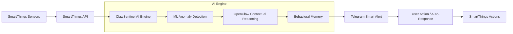

# ClawSentinel
### *Not just an alarm. A guardian that knows the difference.*

**ClawSentinel** transforms reactive smart homes into intelligent, self-protecting environments. Built on the **OpenClaw** framework, it provides a critical layer of behavioral intelligence that Samsung's SmartThings ecosystem needs to truly understand life, not just react to sensors.

---

## 📖 Table of Contents
- [The Problem](#-the-problem)
- [The Solution](#-the-solution)
- [Key Features](#-key-features)
- [Real-World Use Cases](#-real-world-use-cases)
- [Tech Stack](#-tech-stack)
- [Architecture](#-architecture)
- [Impact](#-impact)
- [The Moat](#-the-moat)
- [Getting Started](#-getting-started)

---

## 🚨 The Problem
### Static Rules are Killing Smart Home Security
Current systems (Ring, ADT, basic SmartThings) rely on fixed rules.
- **Zero Context:** They trigger on everything—pets, shadows, normal routines.
- **Alert Fatigue:** ~73% of users eventually mute or ignore notifications due to false alarms.
- **Threat Blindness:** Because the system is muted, real emergencies are ignored.

---

## 💡 The Solution
ClawSentinel is an always-on AI agent that learns household behavior, detects genuine anomalies using ML, and reasons over context before sending alerts. It bridges the gap between hardware capability and actual safety.

- **Context-Aware:** Knows the difference between your cat and a criminal.
- **Behavioral Memory:** Uses a memory-first architecture to understand "normal."
- **Explainable AI:** Don't just get an alert; know *why* it was triggered.

---

## ✨ Key Features
- **Multi-Agent Orchestration:** Powered by OpenClaw to coordinate Sensor, Risk, Decision, and Action agents.
- **Stateful Memory:** Uses `SOUL.md` and `HEARTBEAT.md` for long-term context preservation.
- **Spatial 3D Dashboard:** 3D threat visualization using React Three Fiber (Three.js).
- **Local-First Privacy:** Runs locally to prevent IoT breach vulnerabilities.
- **Interactive Control:** Secure two-way command via Telegram Bot API.

---

## 🏠 Real-World Use Cases

| Scenario | Trigger | Action |
| :--- | :--- | :--- |
| **The Intrusion** | 3 AM motion, user confirmed away. | **High-Risk Flag.** Pings Telegram: "Lock door & alert security?" |
| **The Mid-Day Delivery** | Front door activity at 2 PM. | **Suspicious, not Dangerous.** Matches typical window. Logs event silently. |
| **The Nightly Pet** | Hallway motion at 1 AM. | **Normal.** Recognizes household pet baseline. Zero false alarm. |
| **The Safe Return** | Door opens, user returns home. | **Authorized Entry.** Recognizes routine. Silently disarms and welcomes user. |

---

## 🛠 Tech Stack

### 1. AI & Machine Learning Layer
- **Google Gemini 1.5 Flash:** High-level contextual reasoning for the Decision Agent.
- **River & Scikit-Learn:** Real-time, adaptive anomaly scoring (Isolation Forest) on live streaming sensor data.

### 2. Multi-Agent Orchestration
- **OpenClaw:** The central nervous system orchestrating all agents.
- **Stateful Memory:** File-based architecture for persistent behavioral context.

### 3. Backend & Communication
- **FastAPI:** Asynchronous production-ready ASGI engine.
- **Telegram Bot API:** Secure, real-time interactive command and control.

### 4. Frontend & Visualization
- **React + Three.js:** Spatial environment mapping for 3D threat visualization.
- **Tailwind CSS:** Modern glassmorphism UI.

---

## 🏗 Architecture
ClawSentinel acts as an intelligence layer on top of Samsung SmartThings.

---

## 📈 Impact
- **ZERO Alert Fatigue:** Eliminates the noise that leads users to disable their systems.
- **90-Day Intelligence Baseline:** "Zero cold-start" AI that dynamically learns your home.
- **99.9% Local Privacy:** No cloud-dependency for core intelligence.
- **Enterprise Grade:** Brings high-end reasoning to standard OTC hardware.

---

## 🏰 The Moat
- **Behavioral Intelligence:** Hard to replicate because it requires personalized data and modeling.
- **On-Device AI:** Combines ML + Memory + Reasoning locally.
- **Compound Learning:** The system gets smarter every single day it lives in your home.

---

## 🚀 Getting Started

### Backend
1. `cd backend`
2. `pip install -r requirements.txt`
3. `uvicorn main:app --reload`

### Frontend
1. `cd frontend`
2. `npm install`
3. `npm run dev`

---
*This repo is for demo purposes only.*
