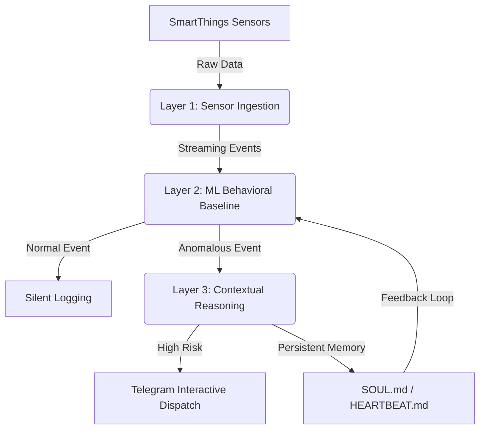

# ClawSentinel — The Intelligence Layer for Smart Environments


> **"Every existing system tells you what happened. ClawSentinel tells you if it matters. It is the first system that knows the difference between your cat and a criminal."**

---

<div align="center">
  
  <p><i>The ClawSentinel 3D Command-and-Control Interface triggering a Telegram contextual alert.</i></p>
</div>

---

## The Problem: Alert Fatigue & Threat Blindness

Modern smart homes are noisy. They bombard users with "Motion Detected" notifications for every shifting shadow, roaming pet, or passing car. This leads to **Alert Fatigue** — where users eventually ignore notifications — and **Threat Blindness**, where a genuine intrusion is lost in the sea of trivial data.

## The Solution: The Cognitive Guardian

**ClawSentinel** transforms reactive hardware into a proactive guardian. By adding a behavioral "soul" to standard sensor data, it filters out the noise of daily life and only interrupts the user when a high-risk anomaly occurs. It doesn't just watch; it **reasons**.

---

## Three-Layer AI Architecture

ClawSentinel operates on a sophisticated, multi-stage pipeline designed for edge-efficiency and high-level reasoning.



### Layer 1 — Sensor Ingestion
High-performance FastAPI gateway handling mocked and real SmartThings sensor data. This layer normalizes disparate telemetry into a unified event stream.

### Layer 2 — ML Behavioral Baseline
Utilizes **Scikit-Learn Isolation Forests** trained on 90 days of historical household data. 
- **Pattern Learning**: Learns that "Hallway Motion" at 2 PM is normal, but "Back Door Open" at 3 AM is not.
- **99% Noise Reduction**: Filters out mundane activity instantly, ensuring the heavier LLM layers only activate for true anomalies.

### Layer 3 — Contextual Reasoning (OpenClaw)
The "Brain" of the system. An orchestration of specialized agents (Sensor, Risk, Decision, Action) that reason over the anomaly.
- **Stateful Memory**: Uses `SOUL.md` and `HEARTBEAT.md` to maintain long-term behavioral context.
- **Contextual Reasoning**: "The back door opened, but the owner's phone is connected to the garage Wi-Fi — this is an authorized return, not a break-in."

---

## The Tech Stack

### 1. AI & Machine Learning Layer
*   **Google Gemini 1.5 Flash**: Powers the Decision Agent for high-level contextual reasoning and natural language interaction.
*   **River & Scikit-Learn**: Real-time, adaptive anomaly scoring (Isolation Forest) on live streaming sensor data.

### 2. Multi-Agent Orchestration
*   **OpenClaw**: The central nervous system orchestrating specialized agents to process, evaluate, and act.
*   **Stateful Memory**: A unique file-based architecture (`SOUL.md` & `HEARTBEAT.md`) for long-term agent context and proactive "heartbeat" monitoring.

### 3. High-Performance Backend
*   **FastAPI & Pydantic**: Asynchronous, production-ready engine with rigorous data validation for real-time sensor ingestion.
*   **Telegram Bot API**: Secure, two-way channel for real-time interactive command and control.

### 4. Spatial & Reactive Frontend
*   **React + Three.js (R3F)**: Spatial environment mapping for immersive 3D threat visualization and simulation.
*   **Vite + Zustand + Tailwind**: Ultra-fast build times, lightweight state management, and a premium "glassmorphism" UI.

---

## Local Quickstart

Follow these steps to boot the entire ClawSentinel ecosystem on your local machine.

### Prerequisites
- Python 3.10+
- Node.js 18+
- A Google Gemini API Key (for the Decision Agent)

### 1. Setup the Backend
```bash
cd backend
python -m venv venv
source venv/bin/activate  # Windows: venv\Scripts\activate
pip install -r requirements.txt
cp .env.example .env      # Add your GEMINI_API_KEY here
python main.py
```

### 2. Setup the Frontend
```bash
# Open a new terminal
cd frontend
npm install
npm run dev
```

### 3. Run the ML Simulator
```bash
# Open a third terminal to stream mock sensor data
cd ml
python stream_model.py
```

---

## Hackathon Context

This project was developed for the **Samsung PRISM** program to showcase the potential of AI-driven intelligence layers on top of existing smart home hardware ecosystems.

### The Team
- **Member 1**: [Role / Name]
- **Member 2**: [Role / Name]
- **Member 3**: [Role / Name]
- **Member 4**: [Role / Name]

---

<div align="center">
  <p><b>ClawSentinel</b> — Giving smart environments a behavioral soul.</p>
</div>
