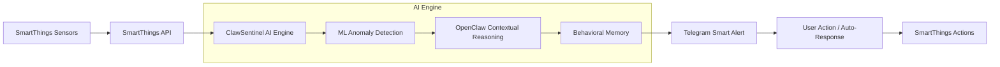
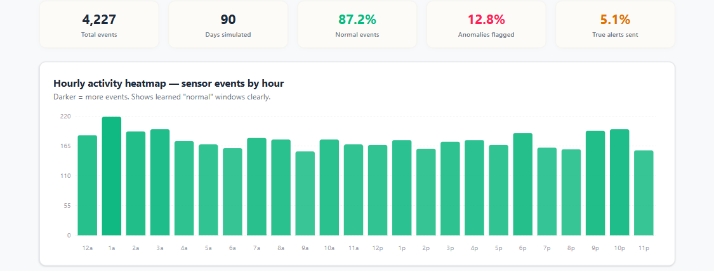
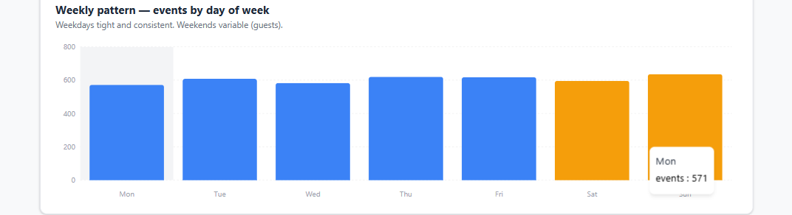
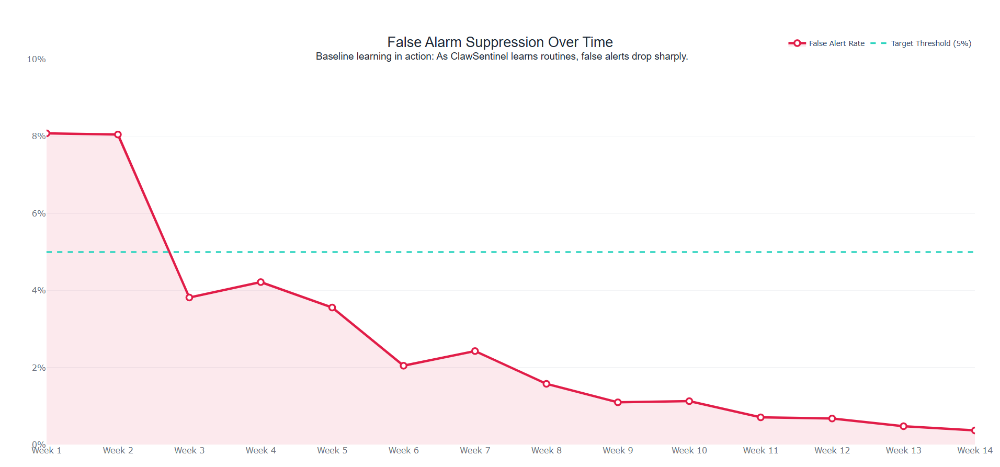
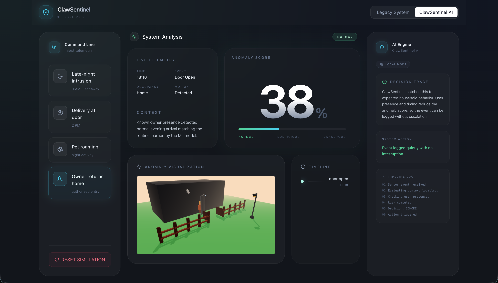
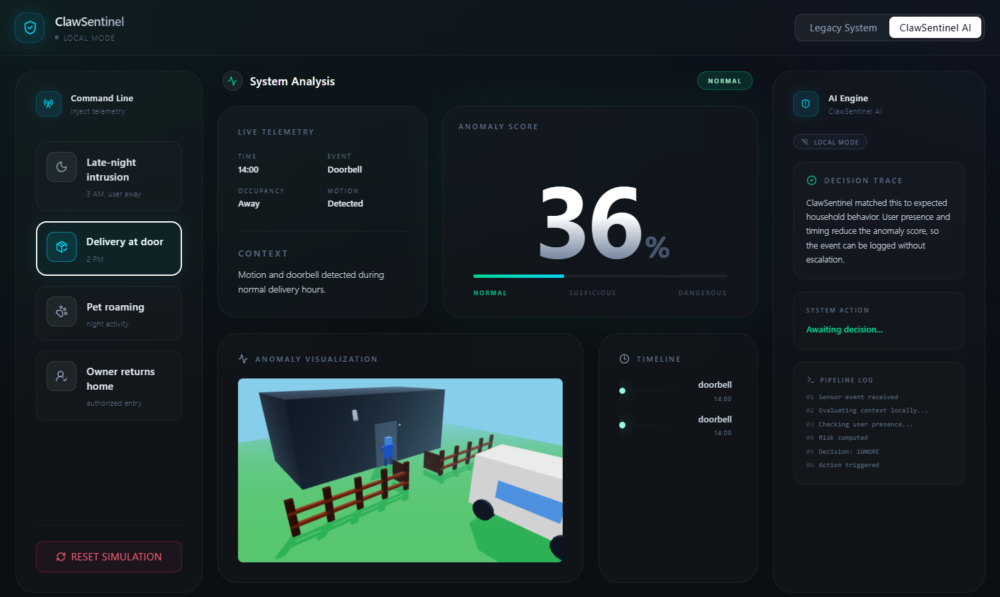
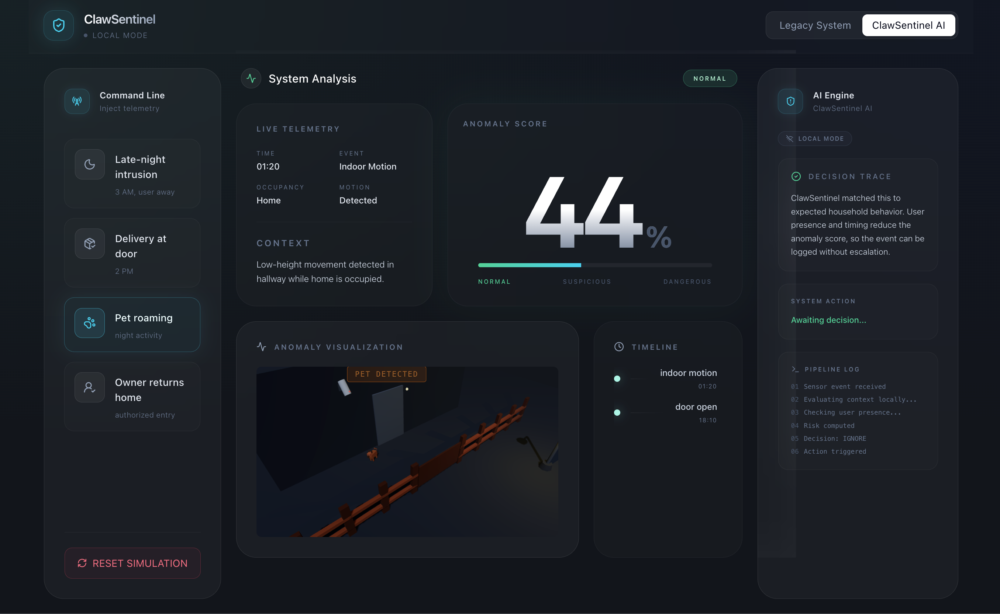

# ClawSentinel — The Intelligence Layer for Smart Environments
### *Not just an alarm. A guardian that knows the difference.*


> **"Every existing system tells you what happened. ClawSentinel tells you if it matters. It is the first system that knows the difference between your cat and a criminal."**
---

DEMO LINK: [Check out our smart claw sentinel](https://youtu.be/o_s7t8y3fTA)

PRESENTATION LINK: https://canva.link/fzn91jknohnwxxy

---

<div align="center">
  
  <p><i>The ClawSentinel 3D Command-and-Control Interface triggering a Telegram contextual alert.</i></p>
</div>

---

## 📖 Table of Contents
- [The Problem](#-the-problem)
- [The Solution](#-the-solution)
- [Three-Layer AI Architecture](#-three-layer-ai-architecture)
- [Key Features](#-key-features)
- [Real-World Use Cases](#-real-world-use-cases)
- [Tech Stack](#-tech-stack)
- [Impact](#-impact)
- [The Moat](#-the-moat)
- [Getting Started](#-getting-started)
- [Hackathon Context](#-hackathon-context)

---

## 🚨 The Problem: Static Rules are Killing Safety
Modern smart homes are noisy. Current systems (Ring, ADT, basic SmartThings) rely on fixed rules that lack nuance.
- **Zero Context:** They trigger on everything—pets, shadows, or normal evening routines.
- **Alert Fatigue:** ~73% of users eventually mute or ignore notifications due to frequent false alarms.
- **Threat Blindness:** Because the system is muted or ignored, real emergencies are lost in the sea of trivial data.

## 💡 The Solution: The Cognitive Guardian
ClawSentinel transforms reactive hardware into a proactive guardian. By adding a behavioral "soul" to standard sensor data, it filters out the noise of daily life and only interrupts the user when a high-risk anomaly occurs. 

- **Context-Aware:** Knows the difference between your cat and a criminal.
- **Behavioral Memory:** Uses a memory-first architecture to understand what is "normal" for *your* home.
- **Explainable AI:** Don't just get an alert; know exactly *why* the system flagged it.

---

## 🏗 Three-Layer AI Architecture
ClawSentinel acts as a sophisticated intelligence layer on top of hardware ecosystems like Samsung SmartThings.



### Layer 1 — Sensor Ingestion
High-performance FastAPI gateway handling telemetry. This layer normalizes disparate data into a unified event stream for analysis.

### Layer 2 — ML Behavioral Baseline
Utilizes **Scikit-Learn Isolation Forests** trained on 90 days of historical data. 
- **Pattern Learning**: Recognizes that hallway motion at 2 PM is normal, but a back door opening at 3 AM is a high-risk anomaly.
- **99% Noise Reduction**: Filters out mundane activity instantly, ensuring the heavier reasoning layers only activate for true threats.

### Layer 3 — Contextual Reasoning (OpenClaw)
The "Brain" of the system. An orchestration of specialized agents that reason over context.

#### 🧠 Stateful Memory Architecture
ClawSentinel uses a dual-layer memory system to maintain behavioral context:
- **Short-Term (Heartbeat)**: A rolling event log stored in [`HEARTBEAT.md`](./backend/memory/HEARTBEAT.md). It tracks the last 50 events and 10 decisions to ensure temporal continuity (e.g., recognizing that an alarm was recently triggered).
- **Long-Term (Soul)**: A persistent behavioral baseline stored in [`SOUL.md`](./backend/memory/SOUL.md). It defines the "identity" of the home—routines, typical hours of activity, and known anomaly signatures.

#### ⚡ Agent Skills
The system's capabilities are formalized as **OpenClaw Skills**, which act as a secure registry of actions the agents can perform:
- [**Notify User**](./backend/skills/notify-user/SKILL.md): Secure Telegram alerts with interactive controls.
- [**Lock Door**](./backend/skills/lock-door/SKILL.md): Physical security actuation (Gated by confirmation).
- [**Start Recording**](./backend/skills/start-recording/SKILL.md): Forensic visual capture triggered by high-risk anomalies.

---

## ✨ Key Features
- **Multi-Agent Orchestration:** Powered by **OpenClaw** to coordinate Sensor, Risk, Decision, and Action agents.
- **Spatial 3D Dashboard:** Immersive threat visualization built with React Three Fiber (Three.js).
- **Local-First Privacy:** Core intelligence runs locally to prevent IoT breach vulnerabilities.
- **Interactive Control:** Secure two-way command and control via Telegram Bot API.

## 📊 Model Training & Performance Dashboard

Our anomaly detection model trains on historical data to build a highly accurate behavioral baseline, drastically reducing false positives.


*Hourly activity heatmap showing the model clearly learning normal sensor windows, with darker bars indicating higher volume.*


*Weekly event patterns demonstrating tight weekday consistency versus more variable weekend behavior.*


*Baseline learning in action: As ClawSentinel learns the home's routines, false alert rates drop sharply over time.*

---

## 🏠 Real-World Use Cases

| Scenario | Trigger | Action |
| :--- | :--- | :--- |
| **The Intrusion** | 3 AM motion, user confirmed away. | **High-Risk Flag.** Pings Telegram: "Lock door & alert security?" |
| **The Mid-Day Delivery** | Front door activity at 2 PM. | **Suspicious, not Dangerous.** Matches typical window. Logs event silently. |
| **The Nightly Pet** | Hallway motion at 1 AM. | **Normal.** Recognizes household pet baseline. Zero false alarm. |
| **The Safe Return** | Door opens, user returns home. | **Authorized Entry.** Recognizes routine. Silently disarms and welcomes user. |

---

### Visualizing the Intelligence Layer

<div align="center">
  <h4>Case 1: The Safe Return</h4>
  
  <p><i>Recognizing a routine homecoming and adjusting security state without user intervention.</i></p>
  
  <br/>
  
  <h4>Case 2: The Mid-Day Delivery</h4>
  
  <p><i>Analyzing timing and occupancy to differentiate a courier from a threat.</i></p>

  <br/>
  
  <h4>Case 3: The Nightly Pet</h4>
  
  <p><i>Filtering low-height movement baselines to eliminate false positives.</i></p>
</div>


## 🛠 Tech Stack

### 1. AI & Machine Learning Layer
*   **Google Gemini 1.5 Flash**: High-level contextual reasoning for the Decision Agent.
*   **River & Scikit-Learn**: Real-time, adaptive anomaly scoring (Isolation Forest) on live streaming sensor data.

### 2. Multi-Agent Orchestration
*   **OpenClaw**: The central nervous system orchestrating all specialized agents.
*   **Stateful Memory**: File-based architecture for persistent behavioral context preservation.

### 3. Backend & Communication
*   **FastAPI**: Asynchronous, production-ready ASGI engine with rigorous validation.
*   **Telegram Bot API**: Secure, real-time interactive command and control.

### 4. Frontend & Visualization
*   **React + Three.js**: Spatial environment mapping for 3D threat visualization.
*   **Vite + Zustand + Tailwind**: Ultra-fast builds, reactive state, and modern glassmorphism UI.

---

## 📈 Impact
- **ZERO Alert Fatigue:** Eliminates the noise that leads users to disable their security systems.
- **90-Day Intelligence Baseline:** "Zero cold-start" AI that dynamically learns your home's unique patterns.
- **99.9% Local Privacy:** Core intelligence processed locally for maximum security.
- **Enterprise Grade:** Brings sophisticated behavioral reasoning to standard OTC hardware.

## 🏰 The Moat
- **Behavioral Intelligence:** Hard to replicate as it requires personalized data and site-specific modeling.
- **On-Device AI:** Combines ML + Persistent Memory + LLM Reasoning locally.
- **Compound Learning:** The system gets smarter every single day it lives in your environment.

---

## 🚀 Getting Started

Follow these steps to boot the entire ClawSentinel ecosystem locally.

### 1. Setup the Backend
```bash
cd backend
python -m venv venv
source venv/bin/activate  # Windows: venv\Scripts\activate
pip install -r requirements.txt
cp .env.example .env      # Add your GEMINI_API_KEY and TELEGRAM_TOKEN
python main.py
```

### 2. Setup the Frontend
```bash
# In a new terminal
cd frontend
npm install
npm run dev
```

### 3. Run the ML Simulator
```bash
# In a third terminal to stream mock sensor data
cd ml
python stream_model.py
```

---

## 🏆 Hackathon Context

This project was developed for the **Samsung PRISM** program to showcase the potential of AI-driven intelligence layers on top of existing smart home hardware ecosystems.

### The Team
- **Member 1**: Sreeya Chand
- **Member 2**: Prapti
- **Member 3**: Aniksha Anithan
- **Member 4**: Samyukthaa M

---

<div align="center">
  <p><b>ClawSentinel</b> — Giving smart environments a behavioral soul.</p>
</div>
